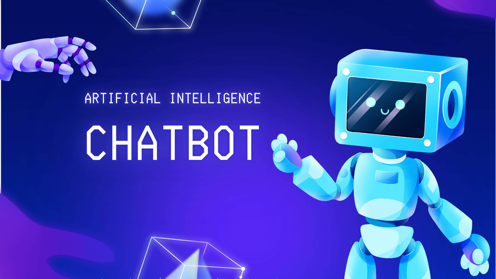
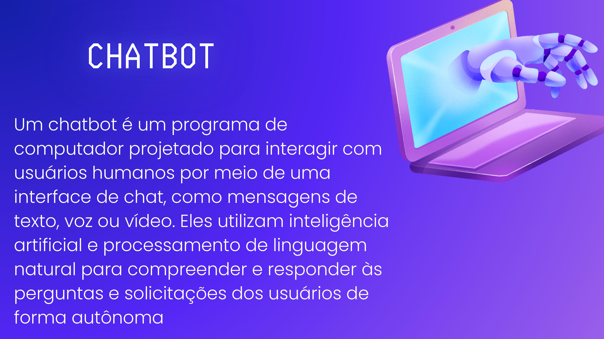
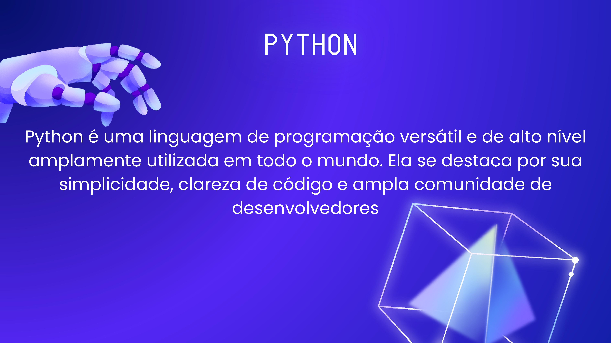
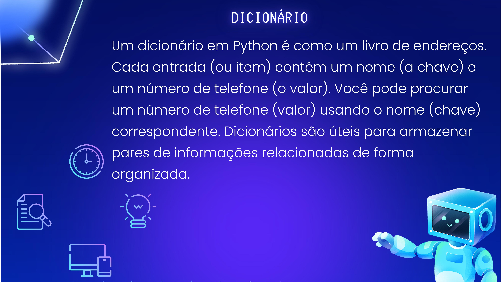

# Chatbot e Python :robot: :snake:
### Mostra de Profissões - Universidade Federal de Viçosa (UFV)
### <a href="https://sin.crp.ufv.br/" target="_blank">Sistemas de Informação</a>

## Chatbot :robot:

Um chatbot é um programa de computador projetado para interagir com usuários humanos por meio de uma interface de chat, como mensagens de texto, voz ou vídeo. Eles utilizam inteligência artificial e processamento de linguagem natural para compreender e responder às perguntas e solicitações dos usuários de forma autônoma.

## Python :snake:

Python é uma linguagem de programação versátil e de alto nível amplamente utilizada em todo o mundo. Ela se destaca por sua simplicidade, clareza de código e ampla comunidade de desenvolvedores.

## Dicionários em Python :book:

Um dicionário em Python é como um livro de endereços. Cada entrada (ou item) contém um nome (a chave) e um número de telefone (o valor). Você pode procurar um número de telefone (valor) usando o nome (chave) correspondente. Dicionários são úteis para armazenar pares de informações relacionadas de forma organizada.

Este repositório contém informações e exemplos relacionados a chatbots, programação em Python e o uso de dicionários em Python.

Sinta-se à vontade para explorar os exemplos e informações aqui para aprender mais sobre esses tópicos. :rocket:

## Autores:
- [Rodrigo Moreira](mailto:rodrigo@ufv.br)
- [Larissa F. Rodrigues Moreira](mailto:larissa.f.rodrigues@ufv.br)
- [Daniel Pereira Monteiro](mailto:daniel.p.monteiro@ufv.br)
- [Lucas Nardelli de Freitas Botelho Saar](mailto:lucas.saar@ufv.br)
